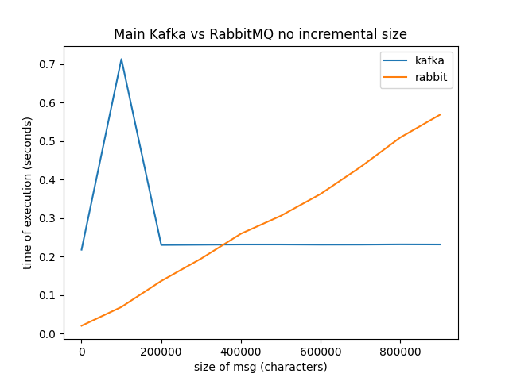
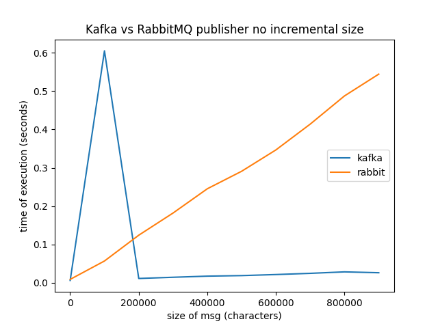
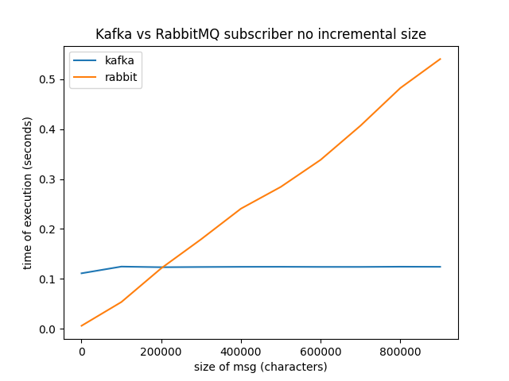

# Kafka vs RabbitMQ
Performance comparison between the two data-streaming platforms.

- [Instalation and quick start](#instalation-and-quick-start)
    - [Docker](#docker)
        - [Install docker client](#install-docker-client)
        - [Download lastest Arch package](#download-lastest-arch-package)
        - [Install the docker desktop package](#install-the-docker-desktop-package)
    - [Kafka](#kafka)
        - [Kafka image instalation and run](#kafka-image-instalation-and-run)
        - [Kafka testing](#kafka-testing)
        - [Kafka deleting](#kafka-deleting)
    - [RabbitMQ](#kafka)
        - [RabbitMQ image instalation and run](#rabbitmq-image-instalation-and-run)
        - [Kafka testing](#rabbitmq-testing)
        - [Kafka deleting](#rabbitmq-deleting)
    - [Using compose](#using-compose)
- [Execution](#execution)
- [Procedure](#procedure)
    - [Program structure](#program-structure)
    - [Measures](#measures)
    - [Program parameters](#program-parameters)
- [Results](#results)
    - [Full program](#full-program)
    - [Publisher](#publisher)
    - [Subscriber](#subscriber)
    - [Conclusions](#conclusions)
- [Proyect structure](#proyect-structure)

## Instalation and quick start
Here is explained step by step the installation of kafka and rabbitmq for Arch Linux with Docker.

### Docker
The following steps are subtracted from the [arch linux instalation guide](https://docs.docker.com/desktop/setup/install/linux/archlinux/) on the Docker docs.

#### Install docker client
```bash
wget https://download.docker.com/linux/static/stable/x86_64/docker-27.4.0.tgz -qO- | tar xvfz - docker/docker --strip-components=1
mv ./docker /usr/local/bin
```

#### Download lastest Arch package
It can be found on the [release notes](https://docs.docker.com/desktop/release-notes/)

```bash
wget https://desktop.docker.com/linux/main/amd64/178034/docker-desktop-x86_64.pkg.tar.zst -qO-
```

#### Install the docker desktop package
```bash
sudo pacman -U ./docker-desktop-x86_64.pkg.tar.zst
```


### Kafka

#### Kafka image instalation and run

This steps can be found on [apache kafka docker docs](https://hub.docker.com/r/apache/kafka) 
To start the broker execute the following command (the image will be automatically pulled):

```bash
docker run -d --name kafka-broker apache/kafka:latest
```

But it can also be done from Docker Desktop.

#### Kafka testing

For testing the instalation 2 terminals are needed. One for the publisher and one for the subscriber.

For opening a terminal a broker terminal execute:
```bash
docker exec --workdir /opt/kafka/bin/ -it kafka-broker sh
```

For creating a topic execute this on one of the broker terminals:
```bash
./kafka-topics.sh --bootstrap-server localhost:9092 --create --topic example_topic
```

For the publisher, type in one of the terminals the following command:
```bash
./kafka-console-producer.sh --bootstrap-server localhost:9092 --topic test-topic
```


And then for the subscriber type this on the other:
```bash
./kafka-console-consumer.sh --bootstrap-server localhost:9092 --topic test-topic --from-beginning
```

As we write in the publisher terminal we should be seeing the same text on the subscriber one.


In the directory `tests/kafka` there are python scripts to check that all the installation is correct.


#### Kafka deleting

For deleting a topic execute this on a broker terminal:
```bash
./kafka-topics.sh --bootstrap-server localhost:9092 --delete --topic test-topic
```

For deleting the container, type this on a normal terminal:
```bash
docker rm -f kafka-broker
```

### RabbitMQ
#### RabbitMQ image instalation and run
Like the previous case its only necesary to install the following command:
```bash
docker run -d --name rabbitmq-broker -p 5672:5672 -p 15672:15672 rabbitmq:3

```
#### RabbitMQ testing
The testing is inside the directory `tests/rabbitmq`.

In one terminal execute the subscriber:
```bash
python3 tests/rabbitmq/rabbitmq_subscriber.py "#"
```
In the other terminal execute the publisher:
```bash
python3 tests/rabbitmq/rabbitmq_publisher.py 
```
A `Hello World` should appear on the subscriber terminal.

#### Kafka deleting

Like Kafka, for deleting the container type:
```bash
docker rm -f rabbitmq-broker
```

### Using compose

On the base directory, execute the following command:
```bash
docker compose up -d
``` 
This will initialize both kafka and rabbitmq.

For removing the containers:
```bash
docker compose down
``` 

*Note*: this is executed by the *"execute_all.bash"* script, so if you are going to use it, there is no need to do it manually.

## Execution

Be ensure to do all the installation steps and type the following command:

```bash
make
```

The performance executions and graphs will be executed.


## Procedure

### Program structure

The **Executer** class handles the initialization and meassuring of time, from wich inherits the **MainExecuter**, this class will generate the data of the *publisher* and implements the iteration and execution of the executer that will call the *publisher* and the *subscriber*. This two are called in the same way as the main one, with the exception that they will do all the iterations indicated by `num_execs` and that they will do a different action (publish on a topic or read its content). All processes are created with the python **multiprocessing** module.

### Measures
The key measure that it is used to analyze both platforms is the `size_msg` parameter (the number of characters in a string message). This measure is complemented with `incremental` option, wich makes messages follow the size $max((size\_msg*list_i/size\_list), 1)$ where $list_i$ is the position in the data list, and $size\_list$ is the size of that same list. In this way, instead of having all messages the same size, they have an **incremental** size (hence its name).

Subscriber measures have been taken having in account the time to read all the messages once the first is disponible. In the publisher the measures go from the send of the first message to the acknowledge that the subscriptor had recived the last. And the main executer measures the time from both plus the initialization.

### Program parameters
The parameters description can be seen by executing the following command:
```bash
python3 src/main_executer.py -h
```
The only two parameters that are needed to clarify (because of their similitud) are:
- **--iteration-size**: The number of messages that are sent for each iteration. Meaning that all this messages will be measured as one unit. The default is $10$.
- **--number-iterations**: The total number of measures that will be done with the same parameters. The default is $100$ (with them the mean is calculated to generate more precise graphs)

## Results

### Full program
|||
:-------------------------:|:-------------------------:
  |  

As it can be seen on the graphs (specialy on the incremental), there is some critical points, in wich *Kafka* increments the time of execution. This is probably due to *Kafka*'s topics partitioned nature. This critical parts are probably moments where *Kafka* is allocating more memory in the partition of the topic because the messages are longer. 

### Publisher
|||
:-------------------------:|:-------------------------:
  |  

Here the difference previously commented is more notable. As it can be seen, *RabbitMQ* time grows exponentially. This is probably because the queue of messages it's getting congested when the size of message grows. In contrast, *Kafka* is faster when the partition is already allocated.


### Subscriber
|||
:-------------------------:|:-------------------------:
  |  

Given the results of the subscriber, the theory of the partitions memory allocation gains strength, because the subscriber operation only retrieves the information that it's probably cached. 


### Conclusions

While *Kafka* has a better improvement in big messages, *RabbitMQ* have the advantage that there is no allocation needed, so it doesn't have that penalization at the first iterations. On the other hand, *RabbitMQ*'s queue could be a drawback when the message is to big.

Having this in mind, for short messages that doesn't require persistence (such as social media notifications) *RabbitMQ* could be a much more interesting choice. But in paradigms that are big data related or need that the time of publishing-consuming stays mostly the same, without being affected, *Kafka* it's the better choice.


## Proyect structure

```bash
├── data
│   ├── KafkaExecuter.csv
│   ├── KafkaExecuter_publisher.csv
│   ├── KafkaExecuter_subscriber.csv
│   ├── RabbitMQExecuter.csv
│   ├── RabbitMQExecuter_publisher.csv
│   └── RabbitMQExecuter_subscriber.csv
├── docker-compose.yml
├── graphs
│   ├── general_execution_incremental.png
│   ├── general_execution_not_incremental.png
│   ├── publisher_execution_incremental.png
│   ├── publisher_execution_not_incremental.png
│   ├── subscriber_execution_incremental.png
│   └── subscriber_execution_not_incremental.png
├── LICENSE
├── makefile
├── README.md
├── requirements.txt
├── scripts
│   ├── execute_all.bash
│   └── generate_graphs.py
├── src
│   ├── Executer
│   │   ├── Executer.py
│   │   ├── __init__.py
│   │   ├── KafkaExecuter
│   │   │   ├── __init__.py
│   │   │   ├── KafkaExecuter.py
│   │   │   ├── KafkaPublisherExecuter.py
│   │   │   └── KafkaSubscriberExecuter.py
│   │   ├── MainExecuter.py
│   │   └── RabbitMQExecuter
│   │       ├── __init__.py
│   │       ├── RabbitMQExecuter.py
│   │       ├── RabbitMQPublisherExecuter.py
│   │       └── RabbitMQSubscriberExecuter.py
│   └── main_executer.py
└── tests
    ├── kafka
    │   ├── kafka_admin.py
    │   ├── kafka_publisher.py
    │   └── kafka_subscriber.py
    └── rabbitmq
        ├── rabbitmq_publisher.py
        └── rabbitmq_subscriber.py
```


- **data**: Data files are stored there by default.
- **docker-compose.yml**: Docker compose that initializes Kafka and RabbitMQ.
- **graphs**: Graphs are stored there by default.
- **LICENSE**: License file.
- **makefile**: Make file to execute all.
- **README.md**: Markdown file with the documentation.
- **requirements.txt**: Requirements for the python porgram.
- **scripts**: Scripts folder.
- **src**: Source code folder.
- **tests**: Tests code folder.

